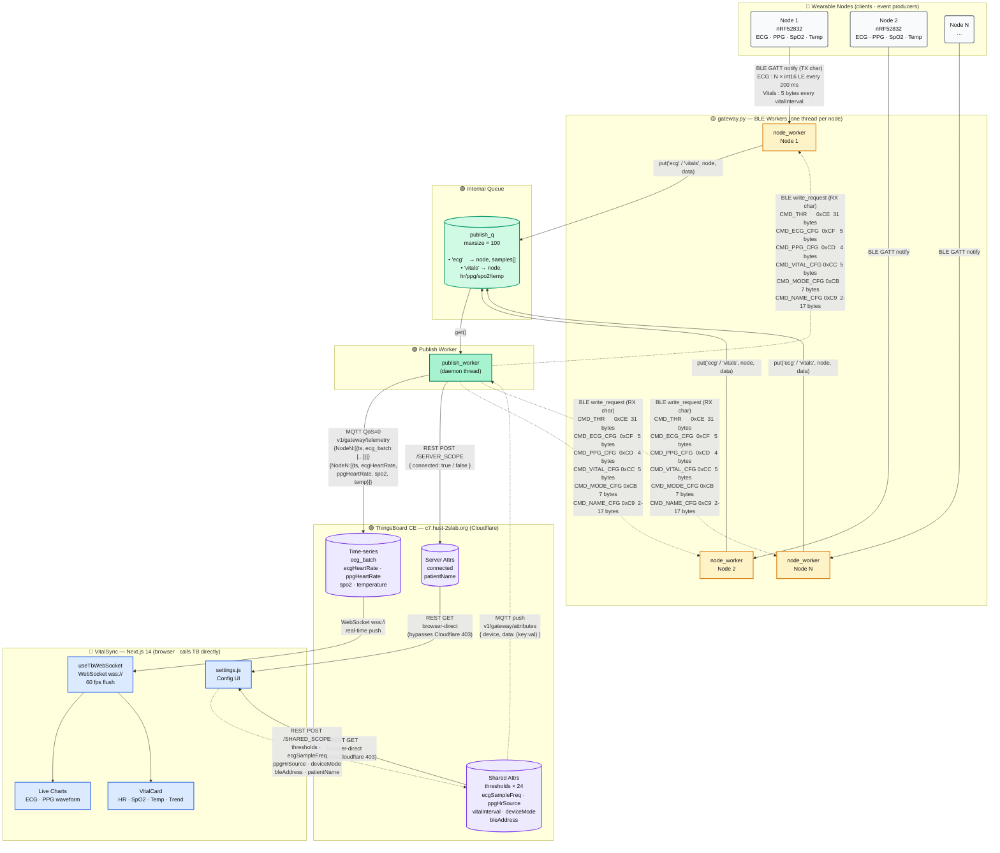

# System Data Flow — VitalSync

---

## Generate a Visual Diagram with ChatGPT

Paste the prompt below into **ChatGPT (GPT-4o)** to get a hand-drawn sketch-style architecture diagram like the reference image.

> **Tip:** GPT-4o's image generation works best when you paste the full prompt as one message. You can ask it to iterate ("make the arrows thicker", "add a config backflow lane") in follow-up messages.

````
Draw a hand-drawn sketch-style software architecture diagram (similar to a whiteboard drawing) for the VitalSync wearable health monitoring system. Use a clean, informal illustration style with thick borders, rounded boxes, and handwriting-like labels. Color-code each layer differently. Include the following layers from top to bottom:

---

LAYER 1 — "Wearable Nodes" (light grey boxes)
  • Node 1 (nRF52832) — sensors: ECG (SAADC 250 Hz), PPG (MAX30102), SpO2, Temperature (TMP117)
  • Node 2 (nRF52832) — same sensors
  • Node N …

LAYER 2 — "gateway.py · BLE Workers" (orange/yellow boxes, one per node thread)
  • node_worker Node 1
  • node_worker Node 2
  • node_worker Node N
  Connection from Layer 1 → Layer 2:
    solid arrow labelled "BLE GATT notify · ECG: N×int16 every 200 ms · Vitals: 5 bytes every vitalInterval"

LAYER 3 — "Internal Queue" (teal/green rounded box)
  • publish_q  (maxsize = 100)
    items: ('ecg', node, samples[]) | ('vitals', node, hr/ppg/spo2/temp)
  Connection from Layer 2 → Layer 3:
    solid arrow labelled "put('ecg' / 'vitals')"

LAYER 4 — "Publish Worker" (teal/green box)
  • publish_worker (daemon thread)
  Connection from Layer 3 → Layer 4:
    solid arrow labelled "get()"

LAYER 5 — "ThingsBoard CE · c7.hust-2slab.org" (purple boxes, behind Cloudflare)
  Three storage nodes side by side:
  • Time-series DB  →  keys: ecg_batch, ecgHeartRate, ppgHeartRate, spo2, temperature
  • Shared Attrs    →  keys: thresholds×24, ecgSampleFreq, ppgHrSource, vitalInterval, deviceMode, bleAddress
  • Server Attrs    →  keys: connected, patientName
  Connections from Layer 4 → Layer 5:
    solid arrow to Time-series:   "MQTT QoS=0 · v1/gateway/telemetry · {NodeN:[{ts, ecg_batch / vitals}]}"
    solid arrow to Server Attrs:  "REST POST /SERVER_SCOPE · {connected: true/false}"

LAYER 6 — "VitalSync · Next.js 14 · browser" (blue boxes, calls ThingsBoard directly)
  • useTbWebSocket  (WebSocket wss://, 60 fps flush)
  • Live Charts     (ECG · PPG waveform)
  • VitalCard       (HR · SpO2 · Temp · trend arrows)
  • settings.js     (Config UI)
  Connections from Layer 5 → Layer 6:
    solid arrow from Time-series to useTbWebSocket: "WebSocket wss:// · real-time push"
    solid arrow from Shared/Server Attrs to settings.js: "REST GET · browser-direct (bypasses Cloudflare 403)"

---

CONFIG / COMMAND BACKFLOW — draw as dashed arrows going upward (bottom to top):

  settings.js  ──►  Shared Attrs
    dashed arrow: "REST POST /SHARED_SCOPE · thresholds · ecgSampleFreq · ppgHrSource · deviceMode · bleAddress · patientName"

  Shared Attrs  ──►  publish_worker
    dashed arrow: "MQTT push · v1/gateway/attributes · {device, data:{key:val}}"

  publish_worker  ──►  node_worker (all nodes)
    dashed arrow: "BLE write_request (RX char) · CMD_THR 0xCE 31b · CMD_ECG_CFG 0xCF 5b · CMD_PPG_CFG 0xCD 4b · CMD_VITAL_CFG 0xCC 5b · CMD_MODE_CFG 0xCB 7b · CMD_NAME_CFG 0xC9 2-17b"

---

Add a legend on the right side:
  🔘 Wearable Nodes  — grey
  🟡 BLE Workers (gateway.py)  — yellow/orange
  🟢 Queue + Publisher  — teal/green
  🟣 ThingsBoard CE  — purple
  🔵 VitalSync Dashboard  — blue
  ──  solid = telemetry (upward)
  ╌╌  dashed = config backflow (downward)

Style notes:
- Use a white or light cream background
- Sketch/hand-drawn aesthetic (slightly wobbly lines, informal font)
- Group each layer inside a rounded rectangle with a label at the top
- Keep arrows readable with small inline labels
````

---

## Architecture Diagram



> **Solid arrows** = upward telemetry (sensor data flowing to cloud and dashboard).  
> **Dashed arrows** = config / command backflow (settings pushed down to the node).

---

## Telemetry Keys

| Key | Direction | Source | Rate |
|---|---|---|---|
| `ecg_batch` | Node → TB | SAADC 250 Hz, filtered | N×int16 per 200 ms packet |
| `ecgHeartRate` | Node → TB | ECG R-R detection on node | every `vitalInterval` ms |
| `ppgHeartRate` | Node → TB | MAX30102 IR/red peak detection | every `vitalInterval` ms |
| `spo2` | Node → TB | MAX30102 ratio | every `vitalInterval` ms |
| `temperature` | Node → TB | TMP117 | every `vitalInterval` ms |

---

## Shared Attributes  (TB → gateway → node via BLE write)

| Group | Keys | BLE command |
|---|---|---|
| Thresholds | `ppgHr_*`, `ecgHr_*`, `spo2_*`, `temp_*` (× 24) | `CMD_THR` (0xCE) |
| ECG config | `ecgSampleFreq`, `ecgPacketInterval` | `CMD_ECG_CFG` (0xCF) |
| PPG config | `ppgSampleFreq`, `ppgHrSource` | `CMD_PPG_CFG` (0xCD) |
| Vital interval | `vitalInterval`, `lcdInterval` | `CMD_VITAL_CFG` (0xCC) |
| Device mode | `deviceMode`, `periodicInterval`, `captureWindow`, `showEcg` | `CMD_MODE_CFG` (0xCB) |
| Patient name | `patientName` | `CMD_NAME_CFG` (0xC9) |
| BLE address | `bleAddress` | triggers reconnect |

---

## Server Attributes  (gateway → TB via REST only)

| Key | Value | Trigger |
|---|---|---|
| `connected` | `true` / `false` | BLE connect / disconnect event |

---

## Key Design Decisions

| Decision | Where | Why |
|---|---|---|
| Browser calls TB directly (not via Next.js API routes) | `settings.js`, `login.js` | Vercel serverless is blocked by Cloudflare with 403 |
| REST `connected` attr instead of TB built-in active state | `_set_connected_attr()` | TB built-in `active` / `lastConnectTime` is unreliable for gateway sub-devices |
| Shared BLE scan cache across node threads | `_find_peripheral()` | Avoids N concurrent scans; all threads share one sweep |
| One `_pending_cmds` slot per command type | `NodeState` | Latest config always wins, no queue overflow |
| `micros()` timing in firmware, never `delay()` | `main.c` | `delay()` blocks the MQTT keepalive loop and causes disconnect |
| `isAnimationActive={false}` on live charts | `TrendChart.js` | Animation at 60 fps on high-Hz waveforms crashes the browser tab |
